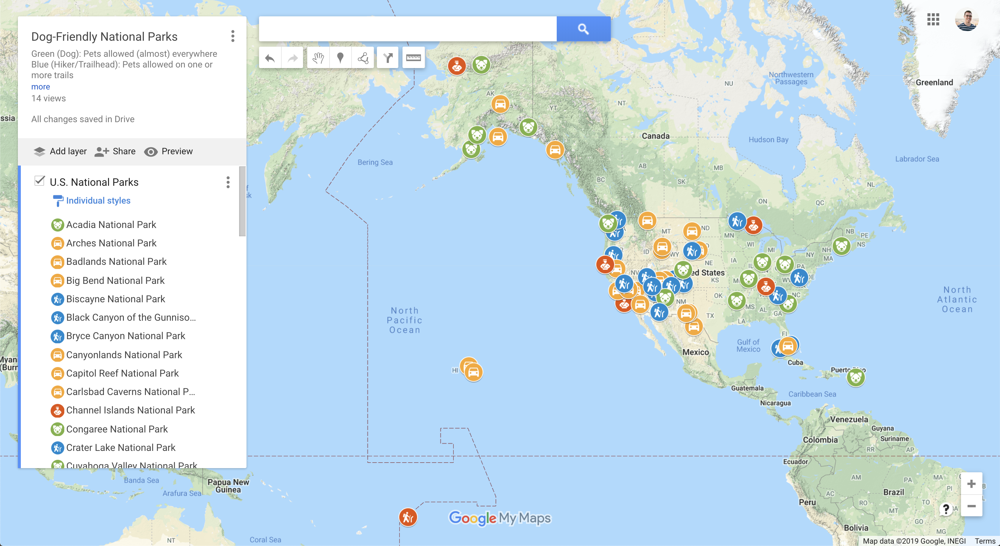

# 🐕 Dog-Friendly National Parks

An open-source, curated map of dog and pet-friendly National Parks in the U.S. (Canada coming soon).

[**Explore on Google Maps**](https://www.google.com/maps/d/u/0/viewer?hl=en&hl=en&mid=1VlDRkZvlXqDfDejOaqFZlnG_fvM5rcxw)

#### Legend

| Color | Icon | Meaning |
|---|---|---|
| Green | Dog| Pets allowed (almost) everywhere in the park, including multiple trails|
| Blue | Hiker / Trailhead | Pets allowed on one or more trails, check park rules & seaonal restrictions before visiting |
| Yellow | Car | Pets only allowed where cars can go, such as paved roads & campgrounds |
| Red | Park Ranger | Pets not allowed 😔 |

Before visiting any park and to get the most up-to-date pet rules and regulations, please visit the [**National Park Service**](https://www.nps.gov/learnandexplore/index.htm) website.

## Data Sources:

First round of data collection was automated using web scraping, second round was done manually via web search / cleanup.

* [**U.S. National Parks – Google Maps**](https://www.google.com/maps/d/u/0/viewer?mid=1US8kt_OlYMffR1KaaEvaqkhYUrs)
* [**National Park Service**](https://www.nps.gov/learnandexplore/index.htm)
* [**Canadian National Parks – Google Maps**](https://www.google.com/maps/d/u/0/viewer?mid=1H8BMnOw1YWxq2Tl6Slvos-HqqdU)

## Corrections & Contributions

Please file an [**issue**](https://github.com/kevinschaich/dog-friendly-national-parks/issues) 😊
